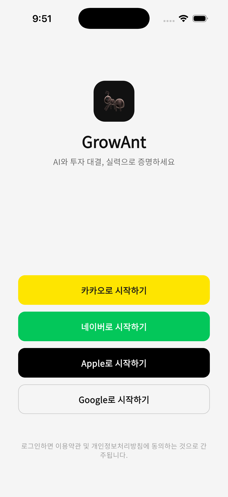
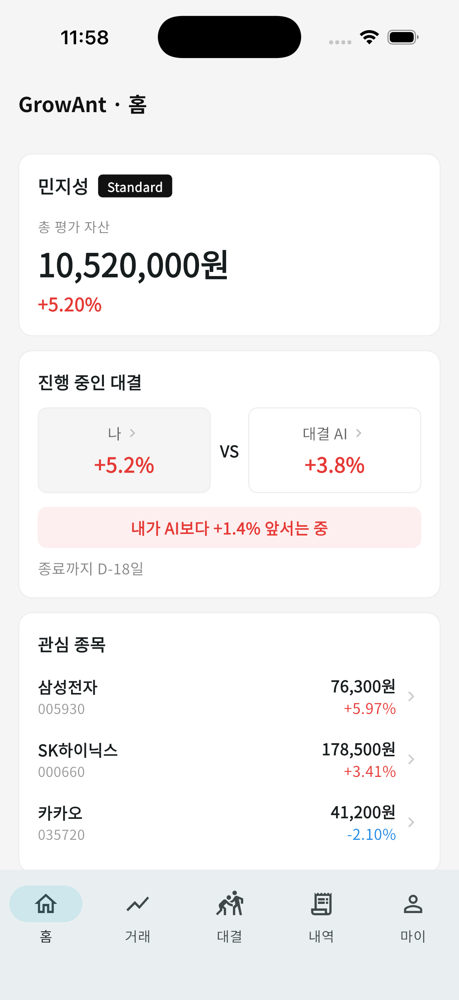
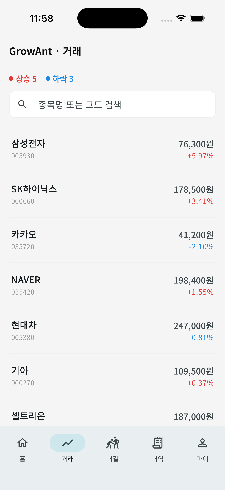
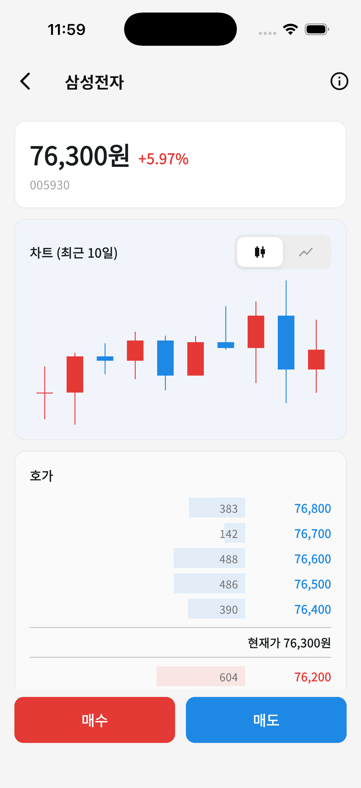
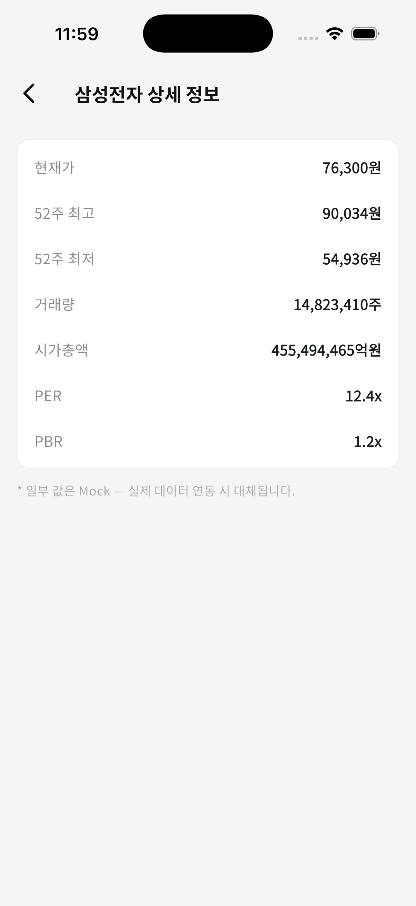
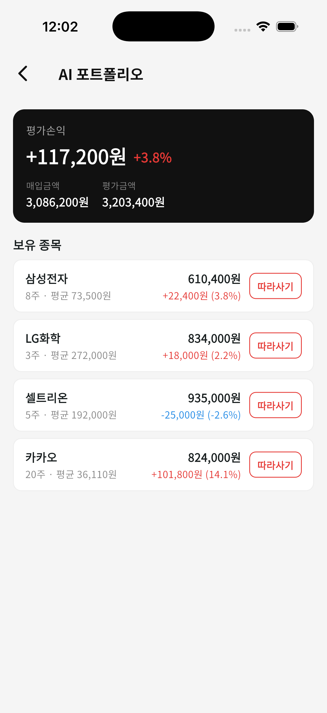
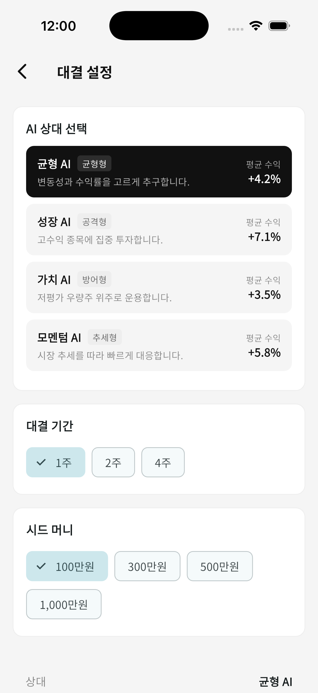
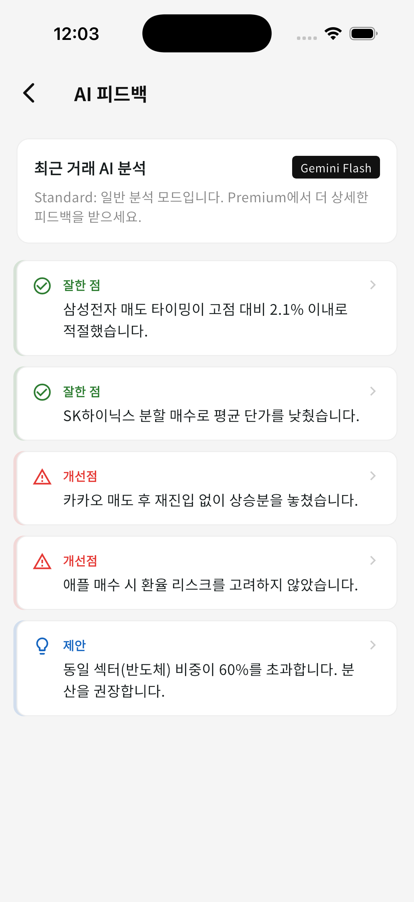
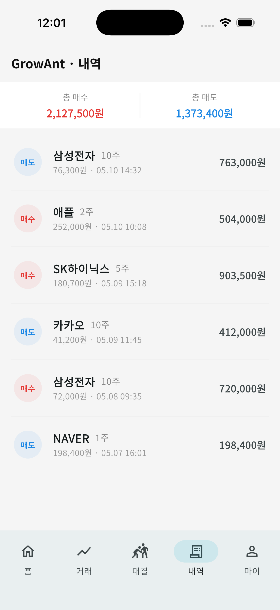
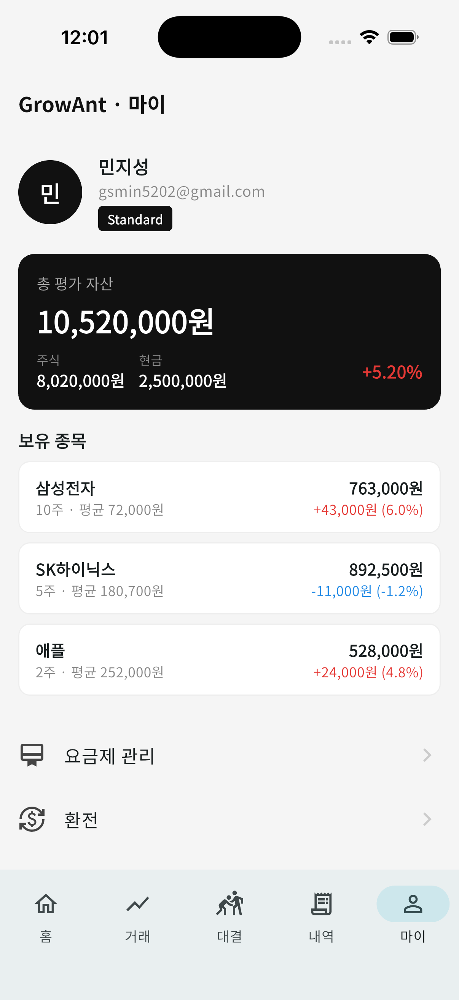

# GrowAnt 🐜

AI와 투자 대결하는 모의투자 앱 — 초보 투자자의 매매 타이밍 연습 + AI 피드백.

## 주요 기능

- **AI 투자 대결** — 성향별 AI(균형·성장·가치·모멘텀)와 기간·시드를 정해 수익률로 대결. 홈에서 내 수익률과 AI 수익률을 비교하고, 각 포트폴리오 상세에서 보유 종목·손익을 확인합니다.
- **따라사기** — AI 포트폴리오의 종목을 탭 한 번으로 종목 상세로 이동해 따라 매수합니다.
- **마켓 & 종목 상세** — 시세 리스트(상승/하락·검색), 종목별 캔들/라인 차트 토글·호가창·상세 정보(52주·거래량·시총·PER/PBR).
- **AI 피드백 & 심리 예측** — 최근 거래를 분석해 잘한 점/개선점/제안과 투자 심리 성향을 제시합니다.
- **거래 · 계좌** — 거래 내역, 보유 종목·평가손익, 배당 일정·환전·요금제.

> 프론트는 Flutter, 백엔드는 Spring Boot. 마켓 시세는 백엔드 `/api/market`로 연동되며(현재 결정적 mock 카탈로그), 나머지 화면은 단계적으로 API로 이전 중입니다.

## 스크린샷

> iPhone 17 시뮬레이터 실제 캡처. 마켓·홈 관심 종목·종목 상세는 백엔드 `/api/market` 실데이터입니다.

|  |  |
|:---:|:---:|
| <br>**로그인** | <br>**홈** — 자산·대결·관심 종목(API 시세) |
| <br>**마켓** — 상승/하락·검색·종목 리스트 | <br>**종목 상세** — 캔들/라인 토글·호가창 |
| <br>**상세 정보** — 52주·거래량·시총·PER/PBR | <br>**AI 포트폴리오** — 보유 종목·따라사기 |
| <br>**대결 설정** — AI 상대·기간·시드 | <br>**AI 피드백** — 잘한 점/개선점/제안 |
| <br>**거래 내역** — 매수/매도 요약·목록 | <br>**마이** — 프로필·자산·보유 종목 |

## 구조
- `backend/` Spring Boot 4 (Kotlin, JDK 21)
- `frontend/` Flutter 3.44
- `infra/` nginx
- `docs/` 설계 문서 (Track A)

## 사전 준비 (팀 PC)
- JDK 21, Flutter 3.44, Docker
- (선택) Supabase 프로젝트 — `.env`는 `.env.example` 참고해 작성

## 실행
```bash
# 인프라 + 백엔드 + Redis
docker compose up -d

# 백엔드 단독
cd backend && ./gradlew bootRun

# 프론트
cd frontend && flutter pub get && flutter run
```

시세는 현재 **시뮬레이션**(`MARKET_PROVIDER=sim`)으로 동작합니다. KIS 전환은 `MarketDataProvider` 구현 교체만으로 가능합니다.

## 문서
`docs/ARCHITECTURE.md` · `docs/ENTITLEMENT.md` · `docs/AI_ROLES.md` · `docs/SCREENS.md`
